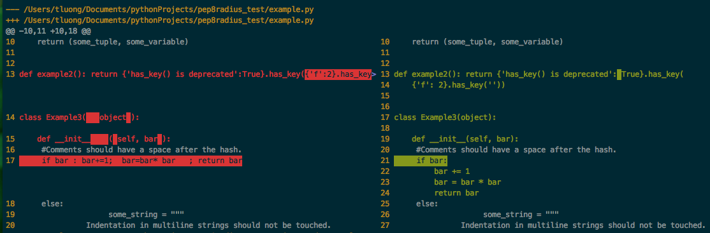

[pep8radius](https://pypi.python.org/pypi/pep8radius)
----------
PEP8 clean only the parts of the files touched since the last commit, a previous commit or (the merge-base of) a branch.

Config Files
------------
pep8radius looks for configuration files as described in the
[pep8 docs](http://pep8.readthedocs.org/en/latest/intro.html#configuration).

At the project level, you may have a `setup.cfg` which includes a pep8 section,
you can use this to define defaults for pep8radius and autopep8.

cdiff
-----
It can be nice to pipe the diff to [cdiff](https://pypi.python.org/pypi/cdiff) (which
makes diffs easier to look at):

Example
-------
`pep8radius master --diff --no-color | cdiff --side-by-side`

